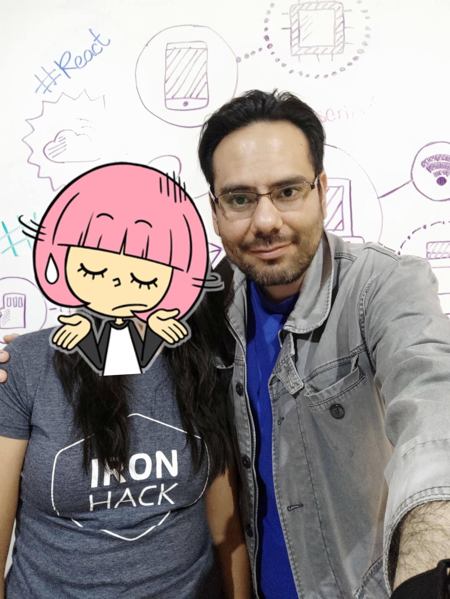

# Cacti Up!

Cacti Up! was a project of my ex-gf for the [IronHack web development bootcamp](http://www.ironhack.com/en/courses/web-development-bootcamp). Her will was to remain anonymous, so I'm using her initials (DC) to credit her.

When we were discussing about game ideas, any simple game that I suggested like Duck Hunt, Block Game Racing, Pong, Flappy Bird, etc., were not viable because they were already been done by students of previous generations, so being a pumper myself, and being involved in StepMania for more than 15 years, it was kind of obvious which game we were going to make.

The code is the byproduct of some misunderstandings, for example, she said "no libraries", I understood that as "no pixi or phaser", but she actually meant "not using an existing project like [StepMania Micro](https://github.com/stepmania/stepmania-micro)".

The code was also the byproduct of me explaing game development concepts to her, like the input/update/render loop, sprites, transitions, linear interpolation, etc., so the code is not production-quality (and it was actually meant to be disposable because I wanted to rewrite it with pixi or phaser).

When we were looking for assets, we found these sprites  and I said "thats it! we're naming the game Cacti Up!", she brought most of the assets, either by searching at Google Images, or by using online resources like [Flaming Text](https://flamingtext.com/) or [Photopea](https://www.photopea.com/).

My intention is to eventually build a simulator to compete against mobile games like [DirectMove](https://play.google.com/store/apps/details?id=net.zsoo.android.dma) and [FiveSteps](https://play.google.com/store/apps/details?id=com.ksandarware.fivestepsandroid), but in a way that respects the intellectual property rights of other artists and without infringing IP rights or patents from [Andamiro](http://www.andamiro.com/).

# Asset credits

I would had loved to credit every original artists behind the assets, but since DC and me broke up and I'm never seeing her again, I'll have to leave it as-is.

- Background Image (Gameplay) - Unable to locate
- Background Image - [leohtt @ pixabay](https://pixabay.com/illustrations/art-silhouette-wasteland-sunset-3525346/)
- Cacti Sprites - Unable to locate
- Cacti Character - [Liizz @ PicsArt](https://picsart.com/i/sticker-cactus-287533266042211)

# Music / Step credits

The song and step files contain intellectual property from, or are licensed to [Andamiro](http://www.andamiro.com/), and they're not meant to be distributed outside the terms and conditions of games like Pump It Up.

PS. DC wanted to have Arcana Force by mzet:-P as the third song, I'm too lazy to extract the assets from PIU Mobile, so officially this project is also "unfinished" lol.

# Source code credits

The contents of the `scripts` folder and `index.html` file are copyrighted to [Aldo Fregoso](https://github.com/AldoMX) and are distributed under the [Creative Commoms Attribution-NonCommercial 3.0 Unported (CC BY-NC 3.0) license](https://creativecommons.org/licenses/by-nc/3.0/).

This license is automatically revoked if you infringe the IP rights or patents from [Andamiro](http://www.andamiro.com/).

# To DC

Thank you for making me the happiest man in the world while our relationship lasted, hope you find in other place what you couldn't find by my side, I cannot say "I love you" anymore but deep inside me I still wish you the best.

